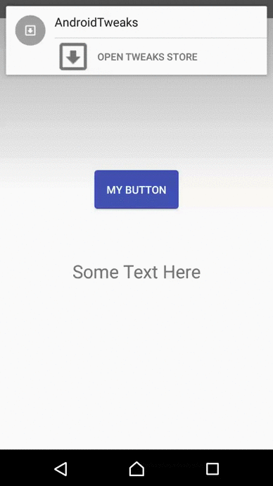

AndroidTweaks
=============

AndroidTweaks provides an easy way of adjusting your Android app at runtime.

Currently we only support activating feature flags (booleans), but we would love to see pull requests where it is possible to adjust a lot more than that at runtime. 

## Overview

Create some Tweaks like this:

```java
public static final TweakBoolean tweak = new TweakBoolean("Styling", "Theme", "Dark", false);
```

Tweaks are currently boolean values. Every Tweak needs to be assigned to a right group and collection, also a default value is required.  
TweakStore can be enabled in a debug build, in other build types default values are applied.




## Installation

Add `compile 'com.github.agensdev:AndroidTweaks:1.1.0'` to your application Gradle dependencies


## Usage

### Create some feature flags

Declare your flags in a place where you can reach it from anywhere in your application
```java
public class MyTweaks {

    public static final TweakBoolean darkTheme = new TweakBoolean("Styling", "Theme", "Dark", false);
    public static final TweakBoolean hapticFeedback = new TweakBoolean("Feedback", "Vibration", "useHapticFeedback", true);
    public static final List<Tweak> tweaks = new ArrayList<Tweak>() {{
        add(darkTheme);
        add(hapticFeedback);
    }};
}
```

### Configure the TweakStore with your tweaks

```java
TweakStore tweakStore = TweakStore.getInstance(this);
tweakStore.setTweaks(MyTweaks.tweaks);
tweakStore.setEnabled(BuildConfig.TWEAKS_ENABLED);
```

### Read value with `getValue`
```java
boolean useDarkTheme = TweakStore.getInstance(reactContext).getValue(MyTweaks.darkTheme)
```

### Live updates with `bind`

```java
tweakStore.bind(MyTweaks.darkTheme, new TweaksBindingBoolean() {
    @Override
    public void value(Boolean value) {
        // do something here
    }
});
```

### Show the hidden tweak panel

All you need to do is show to the `TweakStoreActivity` activity. How you do that is up to you. The way we do it in our apps is to show a notification each time the app gets active. That was the easy solution. [SwiftTweaks](https://github.com/Khan/SwiftTweaks) uses shake gesture. 

```java
public class MyMainActivity extends Activity {
private TweakStore tweakStore;
private NotificationManager notificationManager;

    @Override
    protected void onCreate(Bundle savedInstanceState) {
        super.onCreate(savedInstanceState);
    
        tweakStore = TweakStore.getInstance(this);
        tweakStore.setTweaks(BAXTweaks.allTweaks);
        tweakStore.setEnabled(BuildConfig.TWEAKS_ENABLED);
    
        if (tweakStore.isEnabled()) {
            showNotification();
        }
    }
    
    @Override
    protected void onStart() {
        super.onStart();
        if (tweakStore.isEnabled()) {
            showNotification();
        }
    }
    
    @Override
    protected void onStop() {
        super.onStop();
        notificationManager.cancelAll();
    }
    
    private void showNotification() {
        NotificationCompat.Builder notificationBuilder = new NotificationCompat.Builder(this);
        
        notificationBuilder.setSmallIcon(app_icon_from_resources);
        notificationBuilder.setContentTitle(text_from_resources);
        notificationBuilder.setPriority(Notification.PRIORITY_MAX);
        notificationBuilder.setWhen(0);
        notificationBuilder.setDefaults(Notification.DEFAULT_SOUND);
        
        Intent intent = new Intent(this, TweakStoreActivity.class);
        intent.putExtra(TWEAK_STORE_NAME, tweakStore.getTweakStoreName());
        PendingIntent pendingIntent = PendingIntent.getActivity(this, 0, intent, PendingIntent.FLAG_UPDATE_CURRENT);
        notificationBuilder.addAction(button_icon_from_resources, button_text_from_resources, pendingIntent);
        
        notificationManager = (NotificationManager) getSystemService(NOTIFICATION_SERVICE);
        notificationManager.notify(1, notificationBuilder.build());
    }
}
```


### Disabling the tweaks store

```java
TweakStore tweakStore = TweakStore.getInstance(this);
tweakStore.setEnabled(BuildConfig.TWEAKS_ENABLED);
```


## FAQ

### Can I have multiple TweakStores?

Yep! Just pass a tweakName as an identifier, while creating TweakStore
```java
TweakStore tweakStore = TweakStore.getInstance(this, tweakName);
```

and pass the name of a TweakStore to an intent
```java
Intent intent = new Intent(this, TweakStoreActivity.class);
intent.putExtra(TWEAK_STORE_NAME, tweakStore.getTweakStoreName());
```


## Credits

AndroidTweaks was inspired by the great [SwiftTweaks](https://github.com/Khan/SwiftTweaks) which in turn was inspired by [FBTweaks](https://github.com/facebook/Tweaks/).

We were already using [SwiftTweaks](https://github.com/Khan/SwiftTweaks) in our iOS apps and we needed something similar for  Android. We tried too keep the architecture as close to [SwiftTweaks](https://github.com/Khan/SwiftTweaks) as it was possible for Android in order to provide consistent approach for both platforms.


## Feedback

Your opinion is important to us. We would love to hear what you think about AndroidTweaks. Please let us know [here](https://github.com/agensdev/AndroidTweaks/issues) if you have any ideas how to improve it. Much appreciated! We love pull requests :heart_eyes:

AndroidTweaks is a first library from [Blanka Kulik](https://github.com/blashca) guided by [Håvard Fossli](https://github.com/hfossli) and with a great help from [Arild Jacobsen](https://github.com/Ehyeh-Asher-Ehyeh).

[](http://agens.no/)
